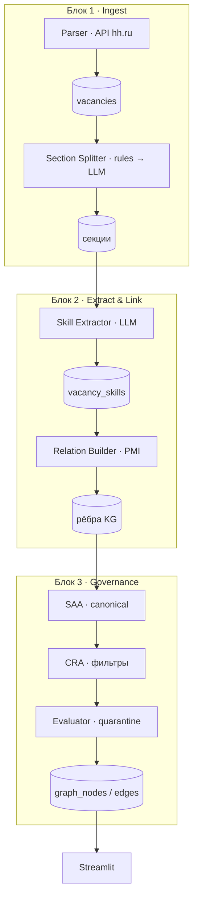

# SkillVerse

AI-платформа управления компетенциями: граф знаний рынка труда (роль ↔ навык, навык ↔ навык) по вакансиям hh.ru, LLM-извлечение навыков и HR/career UI на Streamlit.

Репозиторий: [github.com/zyuzyunda/SkillVerse](https://github.com/zyuzyunda/SkillVerse)

## Что умеет

- **Ingest** — сбор вакансий через официальный API hh.ru (OAuth приложения) с HTML-fallback
- **Секции** — выделение обязанностей и требований (правила → LLM на сложных текстах)
- **Extract** — LLM-извлечение навыков из очищенных секций
- **Market KG** — рёбра `ROLE_REQUIRES_SKILL` и `SKILL_CO_OCCURS` (support + PMI)
- **Governance** — нормализация, фильтры шума, карантин слабых связей
- **UI** — Мультивселенная, Моя вселенная, HR Dashboard, блок Governance
- **Org-слой** — синтетика сотрудников, skill gaps, рекомендации

## Архитектура

Мультиагентная схема с **гибридным** исполнением: LLM только там, где нужна семантика текста; парсинг, статистика связей и основная нормализация — детерминированный код.



Подробнее: [docs/architecture_multiagent.md](docs/architecture_multiagent.md) · [docs/report_technical_summary.md](docs/report_technical_summary.md)

## Стек

| Слой | Технологии |
|------|------------|
| Backend | Python 3.11+, SQLAlchemy, Pydantic |
| БД | PostgreSQL 16 |
| Граф | NetworkX |
| LLM | Ollama (локально) / Groq |
| UI | Streamlit, PyVis |
| Infra | Docker Compose |

## Быстрый старт

### 1. Клон и окружение

```bash
git clone https://github.com/zyuzyunda/SkillVerse.git
cd SkillVerse

cp .env.example .env
# при необходимости отредактируйте .env
```

### 2. Postgres + seed

```bash
docker compose up --build
```

Postgres на хосте: `localhost:5433`

| Параметр | Значение |
|----------|----------|
| user | `competence` |
| password | `competence` |
| database | `competence_platform` |

`DATABASE_URL` в `.env` уже указывает на этот порт.

### 3. Python на хосте

```bash
python3 -m venv .venv
source .venv/bin/activate
pip install -r requirements.txt
```

### 4. UI

```bash
PYTHONPATH=. streamlit run app_streamlit.py
```

Остановка БД: `docker compose down`  
С удалением данных: `docker compose down -v`

---

## Пайплайн hh.ru

### Credentials

1. Зарегистрируйте приложение на [dev.hh.ru](https://dev.hh.ru)
2. В `.env` укажите:

```env
HH_USER_AGENT=SkillVerse/1.0 (your@email.com)
HH_CLIENT_ID=...
HH_CLIENT_SECRET=...
# опционально готовый токен:
# HH_ACCESS_TOKEN=...
```

Без `HH_CLIENT_*` парсер использует HTML-fallback.

### Полный прогон

```bash
# 1. Парсинг
PYTHONPATH=. python -m src.market.parse_hh
# smoke: --limit-per-query 5 --max-pages 2

# 2–7. Секции → extract → граф (+ метрики в отчёте)
./scripts/run_pipeline_hh.sh
```

По шагам:

```bash
PYTHONPATH=. python -m src.market.split_sections --source hh --resume
PYTHONPATH=. python -m src.market.extract_skills_llm \
  --provider ollama --from-sections --require-sections --resume
PYTHONPATH=. python -m src.graph.build_market_graph --source hh --skip-org
```

LLM по умолчанию: `LLM_PROVIDER=auto` (Groq → при сбое локальная Ollama).  
Для офлайна: `ollama serve && ollama pull llama3.2:3b`.

### Org-слой и ассистент (опционально)

```bash
PYTHONPATH=. python -m src.org.generate_synthetic
PYTHONPATH=. python -m src.org.build_org_graph
PYTHONPATH=. python -m src.org.skill_gaps --role data_science
PYTHONPATH=. python -m src.org.recommendations --role data_science

PYTHONPATH=. python -m src.llm.ask --list
PYTHONPATH=. python -m src.llm.ask -q "Кого обучить по MLOps?"
```

---

## Структура репозитория

```
├── app_streamlit.py          # UI (HR / Мультивселенная / Governance)
├── docker-compose.yml        # Postgres + init/seed + parser profile
├── docs/                     # архитектура и техническая справка
├── scripts/
│   ├── run_pipeline_hh.sh    # оркестрация блоков 2–7
│   └── update_report_metrics.py
├── data/                     # seed CSV (рынок)
└── src/
    ├── market/               # parse_hh, sections, LLM extract
    ├── graph/                # normalizer, market KG, governance
    ├── org/                  # сотрудники, gaps, рекомендации
    ├── llm/                  # сценарии ассистента
    └── db/                   # модели Postgres
```

## Конфигурация

Основные переменные — в [`.env.example`](.env.example):

| Переменная | Назначение |
|------------|------------|
| `DATABASE_URL` | Postgres (хост → `:5433`) |
| `HH_CLIENT_ID` / `HH_CLIENT_SECRET` | OAuth приложения hh.ru |
| `HH_USER_AGENT` | `AppName/1.0 (email)` — требование API |
| `HH_DATE_FROM` | Нижняя граница `published_at` |
| `GROQ_API_KEY` / `OLLAMA_*` | Провайдер LLM |
| `LLM_PROVIDER` | `auto` \| `groq` \| `ollama` |

Секреты и токены (`.env`, `.hh_app_token`) в git не коммитятся.

## Лицензия

Пока не указана — при использовании кода и данных hh.ru соблюдайте [условия API hh.ru](https://dev.hh.ru) и не публикуйте персональные данные из вакансий.
