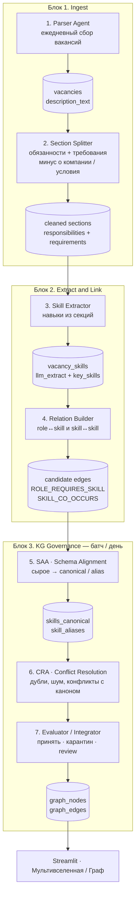
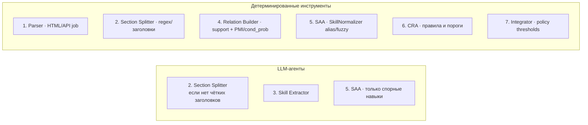
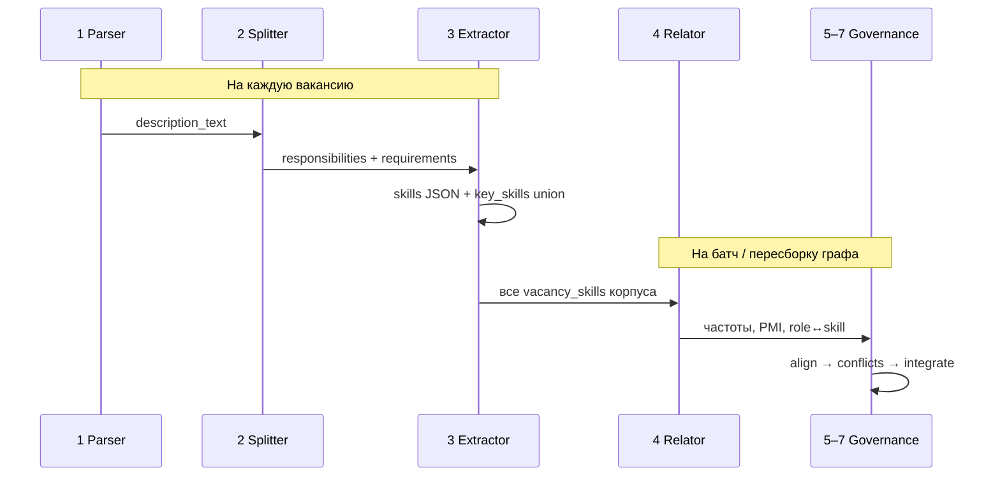

# Мультиагентная архитектура SkillVerse

Документ описывает целевую архитектуру построения графа компетенций
из вакансий: **мультиагентная схема с гибридным исполнением**
(LLM-агенты + детерминированные инструменты).

Репозиторий: [zyuzyunda/SkillVerse](https://github.com/zyuzyunda/SkillVerse).

---

## Зачем гибрид

Семь ролей закрывают полный контур «вакансия → знания в KG», но не каждый
шаг должен быть LLM-агентом:

- парсинг HTML и PMI-связи стабильнее как код;
- LLM — там, где нужна семантика текста (секции, извлечение навыков, спорные кейсы нормализации).

Так архитектура остаётся «мультиагентной» для отчёта/защиты и реализуемой
без семи LLM-вызовов на каждую вакансию.

---

## Общая схема (3 блока, 7 ролей)



---

## Кто чем исполняется



| # | Роль | Исполнение | Выход |
|---|---|---|---|
| 1 | Parser | **Job/cron + scraper** (не LLM) | `vacancies` |
| 2 | Section Splitter | **правила → LLM fallback** | обязанности + требования |
| 3 | Skill Extractor | **LLM** (+ key skills как обогащение) | `llm_extract` / `llm_optional` |
| 4 | Relation Builder | **статистика корпуса** (PMI / cond_prob); LLM опционально типизирует ребро | `ROLE_REQUIRES_SKILL`, `SKILL_CO_OCCURS` |
| 5 | SAA | **Normalizer**; LLM только на ambiguous | `skills_canonical`, aliases |
| 6 | CRA | **правила** (дубли, стоп-слова, редкость) | clean / quarantine |
| 7 | Evaluator | **policy** (пороги confidence); LLM-judge опционально | финальный KG |

---

## Поток: вакансия vs корпус



**Связи Python → pandas / numpy:** агент 4 считает их по **многим вакансиям**
(совместная встречаемость), а не «придумывает» граф из одного текста.
Одна вакансия даёт факт «навыки вместе»; сложный граф — агрегат корпуса.

---

## Приоритет истины (для CRA / Evaluator)

```text
1. Словарь canonical / ручные aliases
2. Статистика корпуса (support, PMI, cond_prob)
3. LLM extract (required)
4. hh key_skills (обогащение)
5. llm_optional — низкий приоритет / вне support по умолчанию
```

---

## Соответствие коду репозитория (as-is)

| Роль | Статус | Где в коде |
|---|---|---|
| 1. Parser | реализован | `src/market/parse_hh.py`, `hh_client.py` |
| 2. Section Splitter | **реализован (rules → LLM на fallback_full)** · ветка `feature/pipeline-block1` | `src/market/split_sections.py` → `section_*`; CLI `--llm-fallback --only-fallback`; QA: Streamlit «Блок 1 · Секции» |
| 3. Skill Extractor | **реализован** · читает секции Block 1 | `src/market/extract_skills_llm.py` (`--from-sections`, Ollama / Groq) |
| 4. Relation Builder | реализован | `src/graph/build_market_graph.py` (`ROLE_REQUIRES_SKILL`, `SKILL_CO_OCCURS`) |
| 5. SAA | реализован (правила + журнал fuzzy) | `src/graph/normalize.py` + `kg_quarantine` |
| 6. CRA | **реализован (правила + карантин)** | `src/graph/governance.py` — noise/stoplist/optional/cooc filters |
| 7. Evaluator | **реализован (policy thresholds + журнал)** | пороги `MIN_*` в `build_market_graph`; QA: Streamlit «Блок 3 · Governance» |

Ежедневный парсер (cron) — в планах; сейчас работаем с загруженным корпусом
(hh + csv_seed + kaggle_ai).

### Запуск текущего пайплайна

```bash
# блок 1: секции (rules); LLM только на слабые fallback_full
PYTHONPATH=. python -m src.market.split_sections --source hh
PYTHONPATH=. python -m src.market.split_sections --source hh --only-fallback --llm-fallback --provider ollama

# извлечение навыков из kept-секций (после split)
# если llm_extract уже был с полного description — перезаписать: --no-resume
PYTHONPATH=. python -m src.market.extract_skills_llm --provider ollama --from-sections --require-sections
# smoke:
# PYTHONPATH=. python -m src.market.extract_skills_llm --provider ollama --from-sections --no-resume --limit 5

# чистка + связи + граф (+ журнал карантина блок 3)
PYTHONPATH=. python -m src.graph.build_market_graph --source hh --skip-org
# UI: «Блок 3 · Governance»

# UI
PYTHONPATH=. streamlit run app_streamlit.py
```

---

## Формулировка для отчёта

> Архитектура SkillVerse — **мультиагентная с гибридным исполнением**:
> семь ролей (ingest → extract/link → governance). LLM используется точечно
> (сегментация при необходимости, извлечение навыков, спорные случаи
> нормализации); парсинг, построение связей skill↔skill и основная
> нормализация выполняются детерминированными модулями над Postgres / NetworkX.
> Результат — граф компетенций с рёбрами спроса роли и совместной
> встречаемости навыков (например Python–pandas–numpy), доступный в Streamlit.
