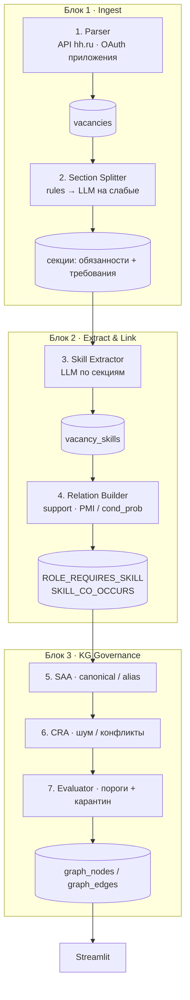

# SkillVerse: итоговая техническая справка (до ~1,5 стр.)

## Цель

**SkillVerse** — платформа построения **графа компетенций рынка труда** по вакансиям (hh.ru) и его использования в аналитике карьеры. Результат: knowledge graph «роль ↔ навык» и «навык ↔ навык» (стеки вроде Python–pandas–numpy) + Streamlit UI (Мультивселенная, Моя вселенная, Governance).

## Архитектурный принцип

Реализована **мультиагентная схема с гибридным исполнением**: семь ролей закрывают контур «вакансия → KG», но LLM вызывается только там, где нужна семантика текста. Парсинг, статистика связей и основная нормализация — детерминированный код (воспроизводимость, контроль качества).

## Схема архитектуры

| # | Роль | Исполнение | Выход |
|---|---|---|---|
| 1 | Parser | Job + **официальный API hh.ru** (HTML — fallback) | `vacancies`, `hh_key_skills` |
| 2 | Section Splitter | **правила → LLM** (`fallback_full`) | `section_*` |
| 3 | Skill Extractor | **LLM** (Ollama/Groq) по kept-секциям | `llm_extract` / `llm_optional` |
| 4 | Relation Builder | Статистика корпуса | рёбра спроса и co-occurrence |
| 5 | SAA | Alias + fuzzy normalizer | `skills_canonical` |
| 6–7 | CRA / Evaluator | Правила, пороги `MIN_*`, журнал `kg_quarantine` | финальный KG |

**Поток:** на каждую вакансию — Parser → Splitter → Extractor; на батч — Relation Builder + governance. Связи skill↔skill считаются по **многим** вакансиям, а не «придумываются» LLM из одного текста.

## Стек

Python 3.11 · PostgreSQL (SQLAlchemy) · NetworkX · Ollama/Groq · Streamlit · Docker (Postgres). Секреты hh (`HH_CLIENT_*`, `HH_ACCESS_TOKEN`) и LLM — в `.env`.

## Ключевые технические решения

1. **Легальный ingest:** приложение на [dev.hh.ru](https://dev.hh.ru), токен приложения, `User-Agent` вида `AppName/1.0 (email)`.
2. **Очистка текста перед LLM:** из description вырезаются обязанности/требования; шум (о компании) не идёт в extract.
3. **Два типа рёбер:** support роли (`ROLE_REQUIRES_SKILL`) и стеки (`SKILL_CO_OCCURS` через PMI / условную вероятность).
4. **Приоритет истины:** словарь canonical → статистика корпуса → LLM required → hh key_skills → llm_optional.
5. **Governance с журналом:** отбраковки (noise, rare, weak cooc, optional) видны в UI «Блок 3».

## Реализация в коде

`parse_hh` / `hh_client` → `split_sections` → `extract_skills_llm --from-sections` → `build_market_graph` → `app_streamlit.py`. Оркестрация: `scripts/run_pipeline_hh.sh`.

## Ориентиры по данным (hh.ru)

Корпус hh после полного пайплайна (Parser → Splitter → Extractor → Graph/Governance), окно date_from ≥ 2025-01-01:

- вакансий: **4393**; роли (топ): business_analytics=1723, data_analytics=594, product_analytics=441, data_science=379, data_engineering=345, ml_engineering=247, llm_agents=153, ai_engineering=143;
- секции: rules=4081, llm=264, fallback_full=13;
- LLM-extract завершён для **4358** вакансий;
- market-KG: **1362** canonical, **899** ROLE_REQUIRES_SKILL, **768** SKILL_CO_OCCURS; сводок карантина: 8.

## Вывод

SkillVerse демонстрирует практичную мультиагентную постановку: агентные роли с чёткими зонами ответственности и гибридным исполнением (LLM + статистика + правила), с воспроизводимым пайплайном от легального парсинга вакансий до интерактивного графа компетенций.
